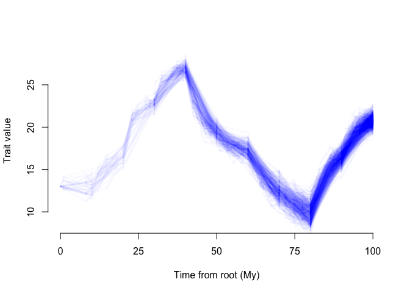

<!-- README.md is generated from README.Rmd. Please edit that file -->

# epcTools

<!-- badges: start -->

[]()
[]()
<!-- badges: end -->

epcTools (**e**co**p**hysiological **c**onstrained trait **Tools**), is
a R package designed to identify how the environment influences
parameters of Ornstein-Uhlenbeck models of trait evolution. This
approach is currently oriented around ecophysiologically constrained
traits, or traits whose expression is modulated by a certain level of
environmental resource availability, but it can be used for other time
varying processes. The current implementation is for single traits.

## Installation

‘epcTools’ can be installed from this github repository. Simply enter
the following code:

``` r
# install.packages("devtools")
devtools::install_github("mason-linscott/epcTools")
```

## General usage

The general workflow for empirical datasets is as follows: create an EPC
cache object -\> run epc.max.lik search

While it may sound simple, all the data needs to be in the right format.
We have included an example empirical dataset with the package to help
users understand the required input format.

``` r
data(diatom_data)

#diatom_cache<-cache.epc(mtree=diatom_data$diatom_tree,epc_params = "alpha",environment_data = #diatom_data$diatom_environment,n_slice = 10, trait_data = diatom_data$diatom_traits[,1,drop=FALSE])

#diatom_epc_search<-epc.max.lik(diatom_cache)
```

## A simulated example

We will need to simulate a phylogeny and environmental vector. We can
then use these two to simulate an EPC cache object which will vary with
the trait of interest.

The sim.epc function requires several arguments. First, the tree and
environmental values but also including other parameters documented
elsewhere such as the type of EPC relationship and what variable(s) are
affected by the environment. Here we simulate a cache object with alpha
and theta varying with the environment and ten time slices.

``` r
#Tree and environment
library(epcTools)
tree_example<-epcTools::sim.tree(100,200,100,1)
env_example<-(c(6,8,11,13,9,8,5,4,8,10))

#Parameters to simulate under
base_sig2=0.5
base_b0_t=1
base_b1_t=2
base_b0_a=0.01
base_b1_a=0.03
base_slice=10


sim0.5f_200b_at_linear<-sim.epc(tree_example,epc_params=c("alpha","theta"),m_type="linear",X=env_example,n_slice=base_slice,1,b0_a=base_b0_a,b1_a=base_b1_a,sig2=base_sig2,b0_t=base_b0_t,b1_t=base_b1_t)
```

## Visualize how the traits are varying with the environment

``` r
#EPC phenogram
sim.epc.phenogram(sim0.5f_200b_at_linear[[1]],10)
```



## epcTools maximum likelihood search

Now, lets see if we can recover the parameters we simulated our model
under. This requires invoking the epc.max.lik() function. Note that this
function can take a vector of starting parameters fed by the user or
find one automatically using the start.searcher function.

``` r
#EPC phenogram
example_results<-epc.max.lik(sim0.5f_200b_at_linear[[1]])
#> Starting initial iterative maximum likelihood search...
#> First search     AIC:371.04
#> Starting second iterative maximum likelihood search...
#> Second search    AIC:371.04
#> Starting third iterative maximum likelihood search...
#> Third search     AIC:371.03
#> Starting last iterative maximum likelihood search...
#> Last search  AIC:371.03
#> [1] "Calculating intervals at a confidence level of 95%"
#> [1] "Done replicate 500"
#> [1] "CI of values (the 24 replicates within 5.53524884675818 neglnL of the optimum)"
#>        neglnL parameter_1 parameter_2 parameter_3 parameter_4 parameter_5
#> [1,] 180.5167    1.289243    1.917195   0.4384032  0.02931129  0.02286026
#> [2,] 186.0165    1.827450    1.982525   0.5336588  0.03796812  0.03014933
#> [1] "Rough volume of good region is 2.11342109218222e-07"
#> [1] "Done replicate 1000"
#> [1] "CI of values (the 75 replicates within 5.53524884675818 neglnL of the optimum)"
#>        neglnL parameter_1 parameter_2 parameter_3 parameter_4 parameter_5
#> [1,] 180.5167    1.036793    1.917195   0.4363600  0.02186464  0.02286026
#> [2,] 186.0518    1.827450    2.007742   0.5336588  0.03796812  0.03014933
#> [1] "Rough volume of good region is 8.17648422492554e-07"
#> [1] "Done replicate 1500"
#> [1] "CI of values (the 188 replicates within 5.53524884675818 neglnL of the optimum)"
#>        neglnL parameter_1 parameter_2 parameter_3 parameter_4 parameter_5
#> [1,] 180.5167    0.934317    1.917195   0.3911493  0.01934746  0.02286026
#> [2,] 186.0518    1.827450    2.020877   0.5336588  0.03796812  0.03014933
#> [1] "Rough volume of good region is 1.7911526888624e-06"
#> [1] "Done replicate 2000"
#> [1] "CI of values (the 271 replicates within 5.53524884675818 neglnL of the optimum)"
#>        neglnL parameter_1 parameter_2 parameter_3 parameter_4 parameter_5
#> [1,] 180.5167     0.88195    1.917195   0.3911493  0.01346175  0.02286026
#> [2,] 186.0518     1.82745    2.023468   0.5336588  0.03796812  0.03014933
#> [1] "Rough volume of good region is 2.55789577953179e-06"
#> [1] "Done replicate 2500"
#> [1] "CI of values (the 399 replicates within 5.53524884675818 neglnL of the optimum)"
#>        neglnL parameter_1 parameter_2 parameter_3 parameter_4 parameter_5
#> [1,] 180.5167     0.88195    1.917195   0.3911493  0.01346175  0.02274696
#> [2,] 186.0518     1.82745    2.023468   0.5336588  0.04281850  0.03014933
#> [1] "Rough volume of good region is 3.11179063412239e-06"

summary(example_results)
#> An EPC - alpha model was ran where those parameters had an linear relationship with the environment
#> 
#> Maximum likelihood estimate:
#> 180.516685686589
#> 
#> Number of Parameters:
#> 5
#> 
#> AIC:
#> 371.033371373177 An EPC - theta model was ran where those parameters had an linear relationship with the environment
#> 
#> Maximum likelihood estimate:
#> 180.516685686589
#> 
#> Number of Parameters:
#> 5
#> 
#> AIC:
#> 371.033371373177
#> 
#> Parameters Estimates: 
#>                      b0_t     b1_t      sig2       b0_a       b1_a
#> best             1.564583 1.943469 0.4534865 0.03545839 0.02597278
#> lower.CI         0.881950 1.917195 0.3911493 0.01346175 0.02274696
#> upper.CI         1.827450 2.023468 0.5336588 0.04281850 0.03014933
#> lowest.examined  0.862477 1.397812 0.2811998 0.01192950 0.01765134
#> highest.examined 1.994447 2.346655 0.6121241 0.04385602 0.03632655
```

Looking at the summarized output, we can see that the maximum likelihood
estimate did indeed recover the linear relationship of the environment
on alpha and theta. However, how confident can we be in these paremeter
estimates? To solve this issue, ‘epcTools’ uses ‘dentist’ to generate
the 95% CI around each of the ML parameter estimates which we can see in
the summary function. However, how do these 95% CI estimates look on a
likelihood surface? Are the parameter estimates on a ridge (not
desirable) or on a well defined peak (desirable). Let’s see what these
look like:

## Dentist parameter visualization

``` r
#Dentist output
plot(example_results)
```


Well, some parameters certainly look more peak like than others but that
is expected. Sig2 and alpha are known to have a ridge like relationship
with each other and this is true for the constituent EPC parameters that
go into either of these (b0a and b1a here). Notice, however, that the
slope parameter (b1a) has a much more defined peak than the intercept
parameter (b0a) which suggests support for a linear relationship. To
really understand if this is real however, we need to compare the AIC of
the EPC-AT model to a single peak OU or BM model. Here, we will just do
OU to save time.

## EPC-AT vs. OU comparison

``` r
#First, we have to change the cache epc params to be "OU" to run an OU search. Then we will skip dentist as we only want the AIC output.
sim0.5f_200b_at_linear[[1]]$epc_params<-"OU"
OU_example<-epc.max.lik(sim0.5f_200b_at_linear[[1]],skip_dentist = TRUE)
#> Starting initial iterative maximum likelihood search...
#> First search     AIC:912.14
#> Starting second iterative maximum likelihood search...
#> Second search    AIC:1.79769313486232e+308
#> Starting third iterative maximum likelihood search...
#> Third search     AIC:912.14
#> Starting last iterative maximum likelihood search...
#> Last search  AIC:912.14


cat(paste0("EPC-AT: ",example_results$fit$AIC, "OU: ",OU_example$AIC))
#> EPC-AT: 371.033371373177OU: 912.14196175986 EPC-AT: 371.033371373177OU: 912.14196175986
```

As you can see, the EPC-AT model has a much lower AIC than the OU model,
indiciating that there is strong support for an EPC-environment
relationship on the trait.
