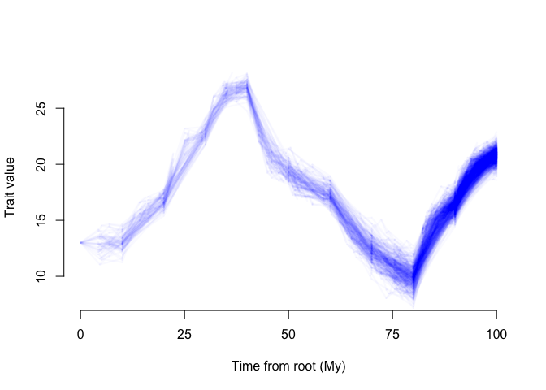
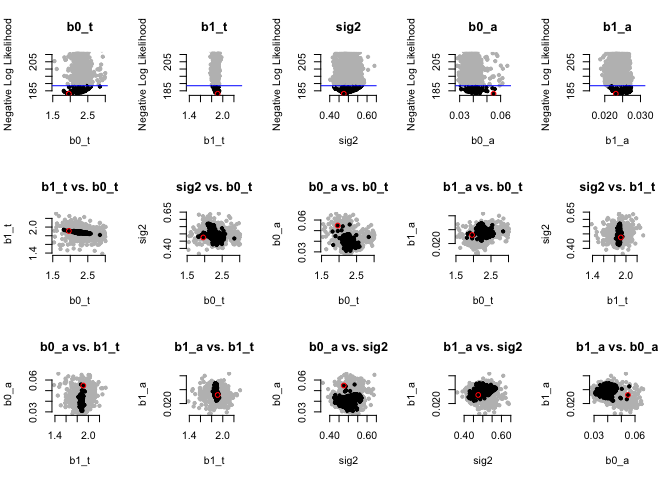

<!-- README.md is generated from README.Rmd. Please edit that file -->

’’‘{r, include = FALSE} knitr::opts_chunk\$set( collapse = TRUE, comment
= “\#\>”, fig.path = “man/figures/README-”, out.width = “100%” )’’’

# epcTools

<!-- badges: start -->

[]()
[]()
<!-- badges: end -->

epcTools (**e**co**p**hysiological **c**onstrained trait **Tools**), is
a R package designed to identify how the environment influencces
parameters of Ornstein Uhlenbeck models of trait evolution. Currently it
does this for only a single trait.

## Installation

‘epcTools’ can be installed from this github repository. Simply enter
the following code:

``` r
# install.packages("devtools")
devtools::install_github("mason-linscott/epcTools")
```

## A simulated example

We will need to simulate a phylogeny and environmental vector. We can
then use these two to simulate an EPC cache object which will vary with
the trait of interest.

The sim.epc function requires several arguments. First, the tree and
environmental values but also including other parameters documented
elsewhere such as the type of EPC relationship and what variable(s) are
affected by the environment. Here we simulate a cache object with alpha
and theta varying with the environment and ten time slices.

``` r
#Tree and environment
library(epcTools)
tree_example<-epcTools::sim.tree(100,200,100,1)
env_example<-(c(6,8,11,13,9,8,5,4,8,10))

#Parameters to simulate under
base_sig2=0.5
base_b0_t=1
base_b1_t=2
base_b0_a=0.01
base_b1_a=0.03
base_slice=10


sim0.5f_200b_at_linear<-sim.epc(tree_example,epc_params=c("alpha","theta"),m_type="linear",X=env_example,n_slice=base_slice,1,b0_a=base_b0_a,b1_a=base_b1_a,sig2=base_sig2,b0_t=base_b0_t,b1_t=base_b1_t)
```

## Visualize how the traits are varying with the environment

``` r
#EPC phenogram
sim.epc.phenogram(sim0.5f_200b_at_linear[[1]],10)
```

<!-- -->

## epcTools maximum likelihood search

Now, lets see if we can recover the parameters we simulated our model
under. This requires invoking the epc.max.lik() function. Note that this
function can take a vector of starting parameters fed by the user or
find one automatically using the start.searcher function.

``` r
#EPC phenogram
example_results<-epc.max.lik(sim0.5f_200b_at_linear[[1]])
```

    ## Starting initial iterative maximum likelihood search...
    ## First search     AIC:737.97
    ## Starting second iterative maximum likelihood search...
    ## Second search    AIC:411.45
    ## Starting third iterative maximum likelihood search...
    ## Third search     AIC:411.45
    ## Starting last iterative maximum likelihood search...
    ## Last search  AIC:411.45
    ## [1] "Calculating intervals at a confidence level of 95%"
    ## [1] "Done replicate 500"
    ## [1] "CI of values (the 28 replicates within 5.53524884675818 neglnL of the optimum)"
    ##        neglnL parameter_1 parameter_2 parameter_3  parameter_4 parameter_5
    ## [1,] 200.7234   0.8677974    1.923792   0.4569893 0.0004016144  0.02687406
    ## [2,] 206.1521   1.5935864    2.023833   0.5833632 0.0006383193  0.03459410
    ## [1] "Rough volume of good region is 1.67676824580573e-08"
    ## [1] "Done replicate 1000"
    ## [1] "CI of values (the 79 replicates within 5.53524884675818 neglnL of the optimum)"
    ##        neglnL parameter_1 parameter_2 parameter_3  parameter_4 parameter_5
    ## [1,] 200.7234   0.8677974    1.909459   0.4569893 0.0004016144  0.02687406
    ## [2,] 206.2457   1.7615136    2.023833   0.5833632 0.0006383193  0.03635349
    ## [1] "Rough volume of good region is 2.89849898015094e-08"
    ## [1] "Done replicate 1500"
    ## [1] "CI of values (the 225 replicates within 5.53524884675818 neglnL of the optimum)"
    ##        neglnL parameter_1 parameter_2 parameter_3  parameter_4 parameter_5
    ## [1,] 200.7234   0.8677974    1.908338   0.4569893 0.0004016144  0.02687406
    ## [2,] 206.2457   1.7615136    2.023833   0.5833632 0.0006383193  0.03649925
    ## [1] "Rough volume of good region is 2.97191936979039e-08"
    ## [1] "Done replicate 2000"
    ## [1] "CI of values (the 375 replicates within 5.53524884675818 neglnL of the optimum)"
    ##        neglnL parameter_1 parameter_2 parameter_3  parameter_4 parameter_5
    ## [1,] 200.7234   0.8677974    1.908338   0.4569893 0.0004016144  0.02687406
    ## [2,] 206.2457   1.7615136    2.023833   0.5930188 0.0006383193  0.03676608
    ## [1] "Rough volume of good region is 3.28767325150994e-08"
    ## [1] "Done replicate 2500"
    ## [1] "CI of values (the 510 replicates within 5.53524884675818 neglnL of the optimum)"
    ##        neglnL parameter_1 parameter_2 parameter_3  parameter_4 parameter_5
    ## [1,] 200.7234   0.8677974    1.908338   0.4569893 0.0004016144  0.02687406
    ## [2,] 206.2457   1.7615136    2.023833   0.5930188 0.0006383193  0.03676608
    ## [1] "Rough volume of good region is 3.28767325150994e-08"

``` r
summary(example_results)
```

    ## Model Type:
    ## alpha linear
    ## 
    ## Maximum likelihood estimate:
    ## 200.723357859623
    ## 
    ## Number of Parameters:
    ## 5
    ## 
    ## AIC:
    ## 411.446715719246 Model Type:
    ## theta linear
    ## 
    ## Maximum likelihood estimate:
    ## 200.723357859623
    ## 
    ## Number of Parameters:
    ## 5
    ## 
    ## AIC:
    ## 411.446715719246
    ## 
    ## Parameters Estimates: 
    ##                       b0_t     b1_t      sig2         b0_a       b1_a
    ## best             1.5527626 1.941907 0.5037025 0.0004963497 0.03117389
    ## lower.CI         0.8677974 1.908338 0.4569893 0.0004016144 0.02687406
    ## upper.CI         1.7615136 2.023833 0.5930188 0.0006383193 0.03676608
    ## lowest.examined  0.6443076 1.412109 0.4196763 0.0003361091 0.02095273
    ## highest.examined 1.8606975 2.526612 0.6621096 0.0008086131 0.04040731

## Dentist parameter visualization

``` r
#EPC phenogram
plot(example_results)
```

<!-- -->
